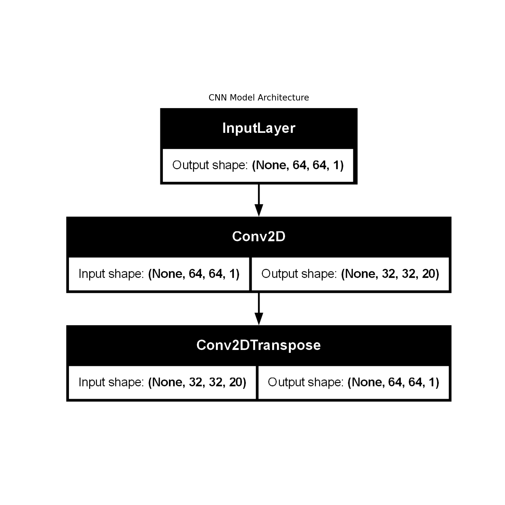
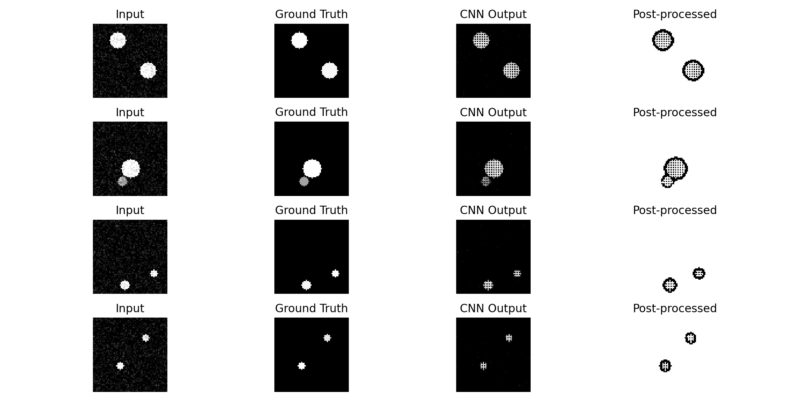
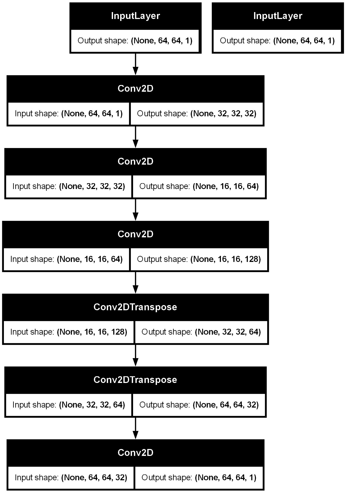

# CNN-Based-for-Phase-Retrieval-in-Optics

**Abstract:**  
We present a compact, end‑to‑end convolutional neural network (CNN) framework for phase retrieval in computational imaging, demonstrated on synthetic holographic data. The system is implemented in Python using TensorFlow/Keras and is designed to reconstruct object amplitude images directly from noisy hologram inputs. Synthetic datasets are generated procedurally, with ground‑truth objects modeled as random circular patterns and corresponding holograms simulated via additive noise perturbations.  

The network adopts a minimal encoder–decoder architecture, consisting of a single downsampling convolutional layer followed by an upsampling transposed convolution, enabling rapid training and interpretability. The model is trained using mean squared error (MSE) loss and evaluated on a held‑out test set, with performance visualized through loss curves and qualitative reconstructions. Post‑processing via adaptive local thresholding is applied to enhance object delineation.  

The framework automatically organizes outputs into a structured directory hierarchy, saving model diagrams, training logs, and prediction visualizations. This demonstrator serves as a reproducible baseline for exploring deep learning‑based phase retrieval, with potential extensions to more complex architectures, realistic hologram simulations, and experimental datasets.

# CNN Phase Retrieval from Synthetic Holograms

## Overview
This project implements a **convolutional neural network (CNN)** for retrieving object amplitude images from synthetic holograms.  
It is a **minimal, fully reproducible** example of deep learning applied to computational imaging, suitable for:
- Educational demonstrations
- Research prototyping
- Portfolio presentation

The pipeline:
1. **Generates synthetic hologram–object pairs**
2. **Trains a CNN encoder–decoder** to map holograms to objects
3. **Evaluates** on a test set with visual and quantitative metrics
4. **Post‑processes** outputs using adaptive local thresholding

## Features
- **Synthetic Data Generation**:
  - Random circular object patterns
  - Additive Gaussian noise to simulate holograms
- **CNN Architecture**:
  - Single Conv2D downsampling layer
  - Single Conv2DTranspose upsampling layer
  - MSE loss, Adam optimizer
- **Visualization**:
  - Sample input/ground‑truth pairs
  - Model architecture diagram
  - Training/validation loss curves
  - Prediction grids with post‑processing
 
  - 
- **Automated Output Management**:
  - Plots, models, and GIFs saved in structured folders

## Requirements
- Python 3.x
- NumPy
- Matplotlib
- TensorFlow / Keras
- scikit‑image

pip install numpy matplotlib tensorflow scikit-image

## Usage
Run the script:

CNN Based Phase Retrieval.py

## Output Examples
- **`sample_inputs_labels.png`** — Example hologram/object pairs
- **`model.png`** — CNN architecture diagram
- **`training_loss.png`** — Training and validation loss curves
- **`predictions.png`** — Side‑by‑side comparison of input, ground truth, CNN output, and post‑processed result

## Customization
- `num_samples` — Number of training/testing samples
- `img_size` — Image resolution
- `epochs`, `batch_size` — Training parameters
- Network depth and filter sizes can be modified in the architecture section

## Potential Extensions
- Replace synthetic holograms with simulated Fresnel or Fourier holograms
- Incorporate complex‑valued CNNs for amplitude and phase retrieval
- Train on experimental holography datasets
- Add skip connections (U‑Net) for improved reconstruction fidelity

## References
- Rivenson, Y., Zhang, Y., Günaydın, H. et al. "Phase recovery and holographic image reconstruction using deep learning in neural networks," *Light: Science & Applications*, 7, 17141 (2018).
- Goodfellow, I., Bengio, Y., Courville, A. *Deep Learning*, MIT Press (2016).

## License
MIT License: free to use, modify, and distribute with attribution.
